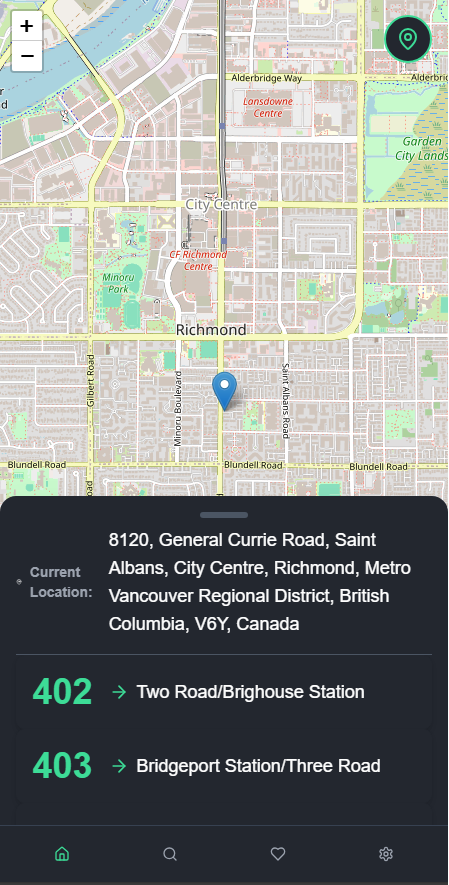
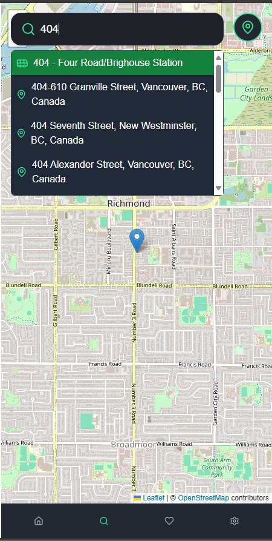
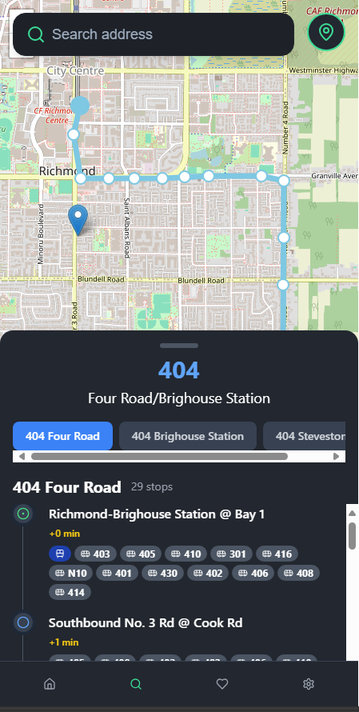
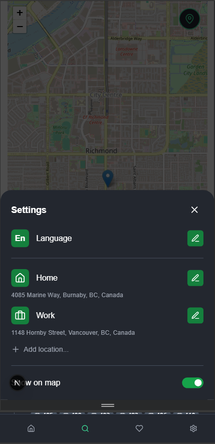
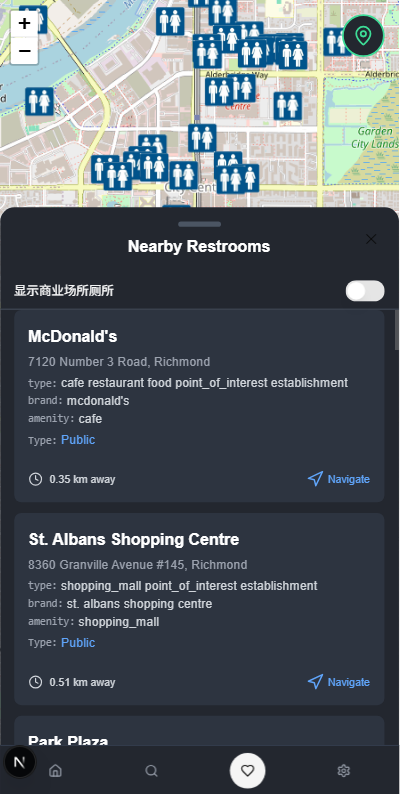

# gobus
# GoBus 公交查询应用

GoBus是一款功能全面的公交地铁查询应用，帮助用户轻松查找公交线路、查看沿途站点、获取清晰的换乘信息，以及查找附近的厕所设施。

## 🌟 主要功能

### 公交线路查询
- 查看附近公交线路，按距离排序显示
- 输入线路编号或名称搜索特定路线（如"501 Queen"、"99 B-Line"）
- 显示线路详情，包括首末班车时间、所有站点和换乘点

### 站点信息
- 查看站点详细信息和经过该站点的所有线路
- 获取实时或预计到达时间
- 支持站点收藏功能

### 地图可视化
- 地图上显示公交线路、站点位置和实时车辆信息
- 支持地图缩放、平移和定位到当前位置
- 直观显示站点和线路关系

### 离线功能
- 自动缓存公交和地铁的线路、站点和时刻表数据
- 无网络连接时自动切换到离线模式
- 离线状态下仍可查询已缓存的静态数据

### 厕所查找
- 查找附近的公共厕所和商业场所厕所
- 显示厕所详细信息（地址、距离、无障碍设施等）
- 支持在地图上查看和定位厕所位置

### 多语言支持
- 支持英语、中文和法语三种语言
- 语言设置自动保存，下次启动时自动恢复

## 📱 应用界面预览

以下是应用的主要界面截图：

### 主界面

主地图界面，显示附近的公交线路、目的地和时间信息，支持定位到当前位置。

### 路线搜索

路线搜索界面，显示搜索结果和详细的线路信息。

### 线路显示

地图上显示公交线路，包括实时位置和服务提醒。

### 站点选择

显示选中站点的详细信息和线路信息。

### 站点列表

详细的公交站点列表，显示每个站点的到达时间和换乘信息。

## 技术栈

- **前端框架**: React.js, Next.js
- **UI组件**: Radix UI, Tailwind CSS
- **地图可视化**: Leaflet, React Leaflet
- **数据处理**: SQLite, sql.js
- **国际化**: next-intl
- **状态管理**: React Hooks
- **构建工具**: Webpack, Babel
- **测试框架**: Jest, Testing Library

## 开发环境设置

This project uses [pnpm](https://pnpm.io/) as its package manager. Please ensure you have pnpm installed before setting up the development environment.

### Install pnpm

If you haven't installed pnpm, you can do so with:

```bash
npm install -g pnpm
```

### Install dependencies

Before installing dependencies, you may need to clean pnpm's cache if you're encountering issues:

```bash
pnpm cache delete
```

Then install dependencies:

```bash
pnpm install
```

If you encounter any issues with node-gyp or native modules, you might need to install them separately:

```bash
pnpm install sqlite3
```

### Environment Variables

To use the Public Bathrooms API, you need to get an API key from RapidAPI:

1. Visit [RapidAPI Public Bathrooms](https://rapidapi.com/wanderlog-wanderlog-default/api/public-bathrooms)
2. Sign up or log in to your RapidAPI account
3. Subscribe to the Public Bathrooms API
4. Copy your API key from the dashboard

Create a `keys/keys.json` file in the project root and add your API key:

```json
{
    "MapApi": {
        "Google":{
            "apiKey": ""
            },
        
        "Mapbox": {
            "apiKey": ""
            }
    },
    "RapidAPI": {
        "PublicBathrooms": {
            "apiKey": "your_rapidapi_key_here"
        }
    }
}
```

You can also copy the `keys/keys.json.example` file and replace the placeholder with your actual API key:

```bash
cp keys/keys.json.example keys/keys.json
```

### Start the development server

```bash
pnpm dev
```

### Build for production

```bash
pnpm build
```

If you encounter the "next is not recognized as an internal or external command" error, please ensure that:
1. You have run `pnpm install` successfully
2. The `node_modules` directory exists in your project root
3. The `node_modules/.bin` directory exists and contains the `next` executable

If the issue persists, try clearing the pnpm cache and reinstalling dependencies:

```bash
pnpm cache delete
rm -rf node_modules
rm pnpm-lock.yaml
pnpm install
```

Please refer to the [development environment setup guide](./docs/05-%20development%20env%20setup.md) for more detailed instructions.
